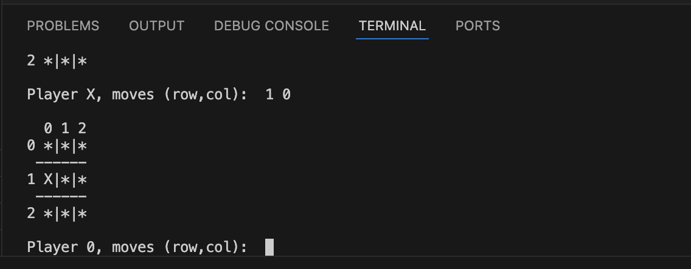

# X&0 game implemented in GO

A command-line X&0 game written in GO.

## Table of Contents

- [Overview](#overview)
- [Requirements](#requirements)
- [How to Run](#how-to-run)
- [Gameplay](#gameplay)
- [Work in Progress](#work-in-progress)
- [Screenshot](#screenshot)


## Overview

This is a 2-player terminal-based X&0 game.

    -The board is a 3x3 grid
    -Players take turns entering their moves
    -The first player to align three symbols horizontally, vertically, or diagonally wins
    -Empty cells are displayed with '*' symbols
    -The range where you can select the row and column is between (0-2) like 1 1; 1 2 etc.
    -The game handles invalid input:
        -If the user enters coordinates out of range, they are prompted again
        -If the chosen cell is already occupied, the player is asked to retry
        -Only numerical input in the format 'row column' is accepted


## Requirements

-Programming Language: Go (Golang)
-Recommended version: 'go1.20+'
-OS: macOS, Linux, Windows


## How to Run

1. Clone the repository:
    ``` bash
    git clone https://github.com/G3orge123/X-0Project.git     
2. Run the game:
    go run main.go


## Gameplay

Players take turns entering their move in the format 'row column'. where both 'row' and 'column' are numbers between 0 and 2.

Example:
-Player X moves (row,col): 0 2

After each move:
-The board is printed to the terminal with the updated symbols
-X and 0 alternate turns
-Empty cells are represented with * for visual clarity

End of Game:
-The game cheks for a winner after every move
-If a player manages to align three of their symbols (horizontally, vertically, or diagonally) a win message is displayed
-If all cells are filled without a winner, the game ends in a draw


## Work in Progress

Player vs AI mode:
-Planned feature that will alow the user to play against a simple AI opponent. The AI will select its moves random, and possibly later with basic strategy like e.g., block or win.
Score tracking:
-Add a scoreboard to keep track of wins, losses, and draws across multiple rounds within the same session.


## Screenshot

An image with the game running in terminal


